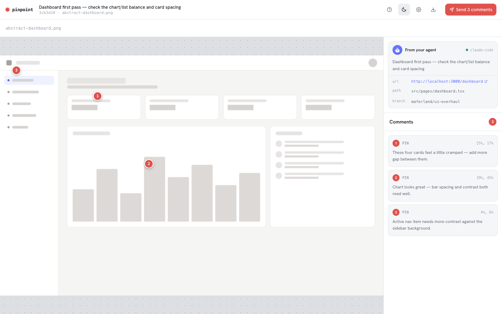

<div align="center">


<h1>Pinpoint</h1>

<p>Point at what's wrong. Claude fixes it.</p>

</div>

---

<p align="center">
  
</p>

<!-- TODO: replace screenshot above with a short GIF of the full loop:
     screenshot → pin → comment → hit Send → Claude applies the fix. -->

You make a UI change. Take a screenshot. Run `/pinpoint:review screenshot.png`. The browser opens. You click on what's wrong, type a sentence, hit Send. The agent picks up structured coordinates and your comment, and works each annotation as a discrete fix. Round-trip is usually under a minute.

Pinpoint works with any visual surface: web pages, iOS simulators, macOS apps, Storybook, design mockups. No target app modification needed.

A review packages into a portable `.pinpoint.zip` you can hand to a designer, a PM, or anyone else with Pinpoint installed. They add their pins, send it back, you re-import. Visual review without locking everyone into the same agent.

## Try the loop in ten seconds (after install)

```bash
pinpoint demo
```

A sample session opens in your browser with a few starter pins on a real screenshot. Edit them, draw your own, hit **Send** in the toolbar to see the structured JSON come back.

## Install

Two paths. Pick whichever you live in.

### From inside Claude Code

```
/plugin marketplace add maferland/pinpoint
/plugin install pinpoint@pinpoint-marketplace
/pinpoint:install
```

The first two add the marketplace and install the plugin (slash commands + skill). The third builds the CLI binary, links it onto PATH, and registers the MCP server. Restart Claude Code once it finishes.

### From the terminal

```bash
curl -fsSL https://raw.githubusercontent.com/maferland/pinpoint/main/install.sh | bash
```

<details>
<summary>Manual install</summary>

```bash
git clone https://github.com/maferland/pinpoint.git ~/.pinpoint
cd ~/.pinpoint && bun install && bun run build
bun link                                                          # exposes `pinpoint` on PATH
claude plugin marketplace add ~/.pinpoint                         # registers the slash command (Claude Code only)
claude plugin install pinpoint@pinpoint-marketplace
claude mcp add pinpoint -- bun ~/.pinpoint/src/main.ts --stdio    # MCP server, works with any MCP-capable agent
```
</details>

Requires [Bun](https://bun.sh) 1.2+.

## Use it with your agent

Pinpoint speaks two protocols. Pick the one your agent supports.

### Claude Code: slash command

```
/pinpoint:review /tmp/screenshot.png
```

The browser opens, you annotate, hit **Send** in the toolbar, the structured JSON lands in the conversation.

### Anywhere with MCP: Cursor, Aider, Continue, raw API, etc.

Register the MCP server once (`claude mcp add pinpoint -- ...` above, or your agent's equivalent), then the agent gets four tools:

| Tool | Description |
|------|-------------|
| `create_review` | Create a review and open the browser. |
| `add_image` | Add another screenshot to an existing review. |
| `get_annotations` | Read structured feedback — coordinates and comments. |
| `list_reviews` | List all review sessions. |

### Anywhere with a shell: direct CLI

```
pinpoint review <image>... [--context "..."] [--port N]
```

Spawns the annotation server, opens the browser, blocks until you hit **Send** in the toolbar, prints the structured JSON to stdout. Pipe it wherever you want.

## How the annotation UI works

- **Click** anywhere → drops a pin with a highlight box
- **Drag** → draws a rectangular region
- **Click a pin** → popover with a textarea, type your note
- **⌘Enter** saves, **Esc** cancels
- Multiple screenshots → filmstrip with arrow keys to switch
- The send button in the toolbar describes itself: **Looks good** if you've made no annotations, **Send 3 comments** (or whatever the count is) if you have. Either way it closes the loop and returns control to the agent.

What Pinpoint sends back:

```json
{
  "annotations": [
    {
      "number": 1,
      "image": "/tmp/screenshot.png",
      "box": { "x": 10.2, "y": 5.3, "width": 35.0, "height": 12.5 },
      "comment": "Button text is truncated on mobile"
    }
  ]
}
```

Coordinates are percentages, so they're resolution-independent.

## Sharing a session

A review packages into a `.pinpoint.zip` (review manifest plus the raw image bytes). Open it on any machine that has Pinpoint installed.

```bash
pinpoint export <reviewId>                            # writes <reviewId>.pinpoint.zip
pinpoint open path/to/bundle.pinpoint.zip             # someone hands you a session
pinpoint open path/to/bundle.pinpoint.zip --mode new  # keep your local copy untouched
```

The ⬇ button in the toolbar exports the live session straight to your downloads folder. See [the skill docs](skills/using-pinpoint/SKILL.md) for the full flow.

## What's new

See [CHANGELOG.md](CHANGELOG.md). Current version: v0.6.0.

## Credits

Architecture inspired by [plannotator](https://github.com/backnotprop/plannotator): slash command shells out to a CLI binary, blocks until the user finishes their part, pipes structured stdout back into the conversation. Pinpoint applies that pattern to image annotation, and adds a portable session format on top.

## License

[MIT](LICENSE)
